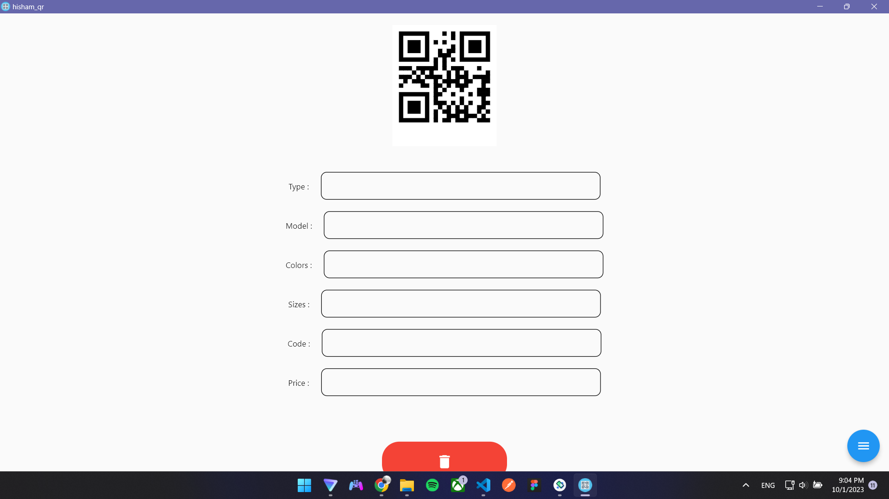
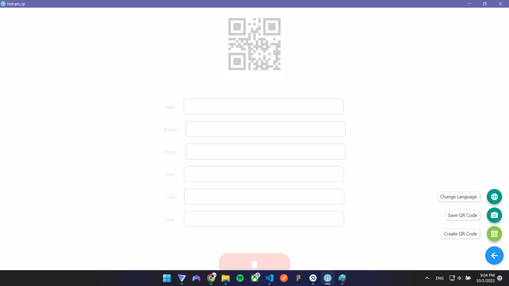
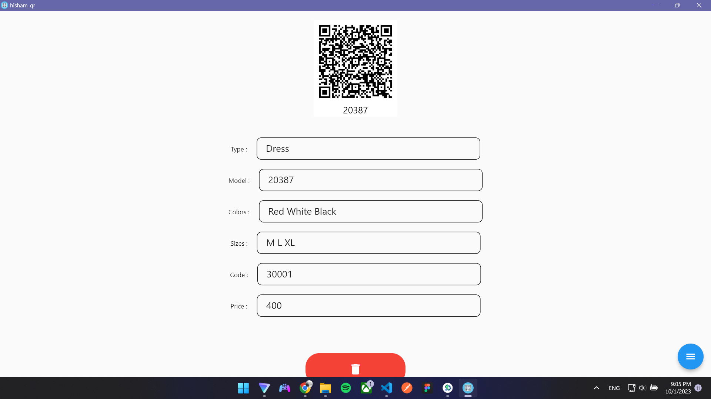

# Desktop QR Generator

## Overview

Desktop QR Generator is a Flutter desktop application developed for Al-Fatinah Uniforms Company to streamline the process of generating and printing QR codes for their products. This app simplifies the task of creating QR codes associated with specific products, making it easier to manage and track inventory.

## Features

- Generate QR codes for products with essential information.
- Customize QR code content for product details.
- Print QR codes directly from the application.
- Store the generated QR code on your PC in a folder.

### Prerequisites

- Flutter SDK installed (version 2.0 or higher)
- Dart SDK installed (version 2.12 or higher)

### Screenshots

Main Screen

QR Code Generation

Printing QR Codes

### License
This project is licensed under the MIT License. See the LICENSE file for more details.

#### Acknowledgments
I extend my gratitude to Al-Fatinah Uniforms Company for their collaboration and support in the development of this application.
